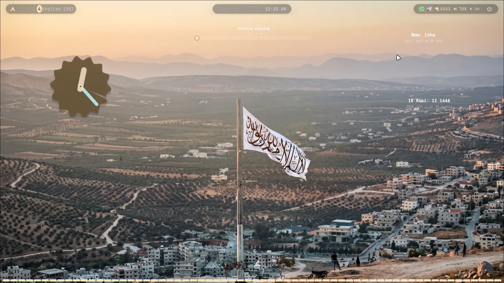
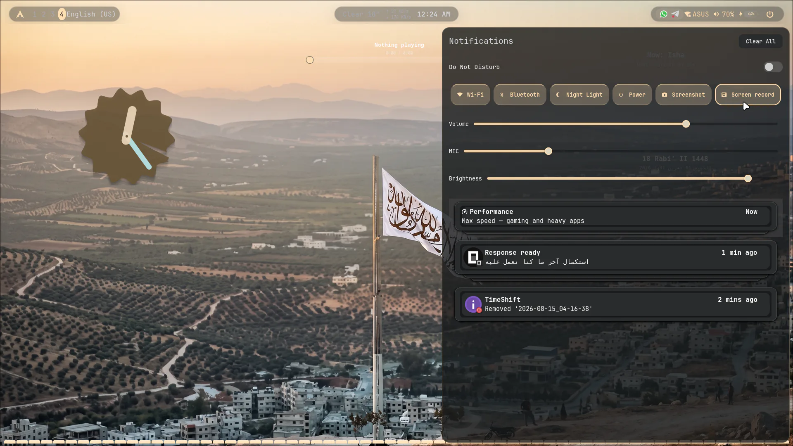
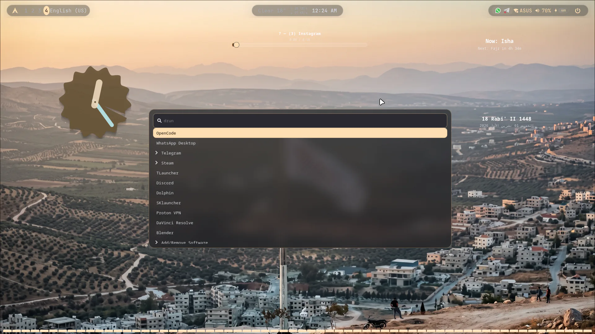
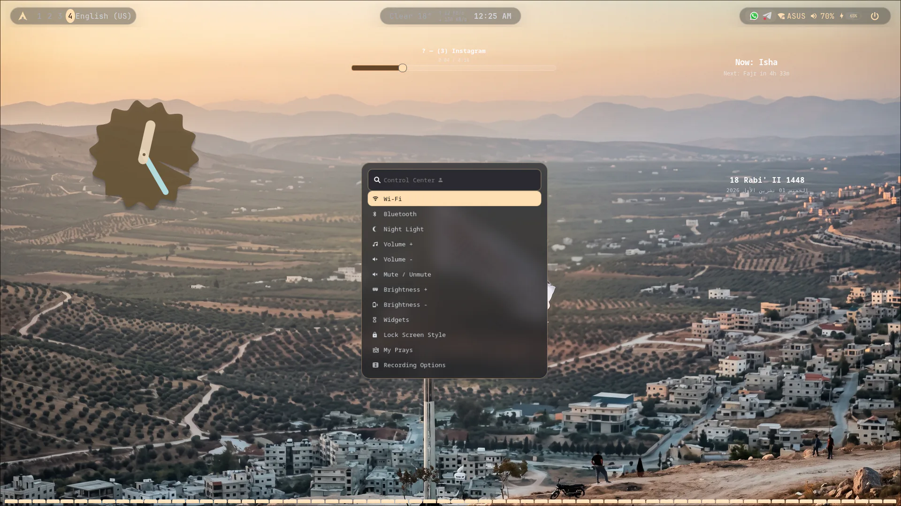

# Hyprland Rice

A complete Hyprland desktop setup: every colour in the session — bars, menus,
terminals, panels, Qt and GTK apps — is derived from the wallpaper by a single
theme engine. Includes a wallpaper pipeline that treats images and video
wallpapers identically, offline prayer times with the adhan, an Arabic/English
interface switcher, and performance profiles.

## 📸 Screenshots

| | | |
|---|---|---|
|  |  | |
| Desktop | Control center | |
|  |  | |
| Glass widgets | Screen-recorder options | |

```
.
├── README.md
├── screenshots/                   desktop shots (webp)
├── .config/hypr/                  Hyprland lua, rules, themes engine, hyprlock
├── .config/rice/                  i18n + performance profile state
├── .config/{kitty,contour,cava,widgets,lockscreen,prayer,qt6ct}/
├── .local/bin/                    every helper script
├── .local/share/rice-lang/        UI translation catalogs
└── .local/share/prayer/adhan.mp3  ship-with-rice adhan audio
```

---

## What this rice does

**One theme engine.** `palette.py` reads the active wallpaper, picks the accent
out of its actual pixels, and writes waybar, swaync, wofi, Contour, Kitty, foot,
fish, cava, GTK and the KDE/Qt6 accent scheme. It runs on every wallpaper
change — nothing else picks colours, so nothing can drift out of sync.

**Wallpapers, images and video alike.** `apply-wallpaper` is the only entry
point for every wallpaper change. It hands `awww` a still — the image itself, or
frame 0 of the video — animates it in with the same `grow` transition, then
passes the screen to `mpvpaper` from that exact frame. Both media therefore
animate identically. Videos are converted once to a cached 1080p60 H.264 copy,
because this laptop's Intel iGPU has no AV1 decoder and a 4K AV1 wallpaper
stalls the whole UI.

**Live translations.** Interface language (`LANG`) is independent of keyboard
layout (`INPUT`). 21 XKB layouts are validated; four that need an input method
are marked as such. Switching either re-skins menus and re-applies the keyboard
without a session restart. Scripts are untranslated English by design — putting
Arabic inside scripts breaks rendering in waybar, wofi and terminals.

**Performance profiles.** Balanced and saver profiles lower animations, blur and
background work, with a suspend timer that switches profiles automatically.
Managed from the control center.

**Prayer times offline.** Computed from astronomy for the configured city, run as
a user systemd service, and the adhan plays through the mixer with a **Seen**
button that stops it. The audio file ships in the repo.

**Widgets.** A set of GTK glass widgets (clock, music, system, Miku, prayer,
Hijri date) plus the Miku desktop pet. They sit on a real bottom layer, so they
float above the wallpaper but under every window and show on all workspaces.

---

## Keybindings

`SUPER` is the Super/Windows key. All bindings live at the bottom of
`.config/hypr/hyprland.lua`; after editing, run `hyprctl reload`.

### Apps

| Keys | Action | Changes |
|------|--------|---------|
| `SUPER + SPACE` | App launcher (`wofi --show drun`) | — |
| `SUPER + T` | Open terminal | First available of kitty → contour → ghostty → wezterm → foot → alacritty |
| `SUPER + RETURN` | Open terminal | Same chain as `SUPER + T` |
| `SUPER + SHIFT + T` | Open terminal | Same chain, but **contour** first |
| `SUPER + E` | File manager (`dolphin`) | — |
| `SUPER + SHIFT + B` | Firefox | — |
| `SUPER + B` | Cycle power profile | Steps balanced → saver → balanced |

### Windows and workspaces

| Keys | Action | Changes |
|------|--------|---------|
| `SUPER + Q` | Close focused window | — |
| `SUPER + V` | Toggle floating | Window leaves/joins the tiled layout |
| `SUPER + F` | Toggle fullscreen | — |
| `SUPER + D` | Mirror window left ↔ right | Moves the window to whichever half it is not already on, based on its centre vs the monitor centre |
| `SUPER + ←/→/↑/↓` | Focus in direction | — |
| `SUPER + 1…9`, `SUPER + 0` | Focus workspace 1–10 | — |
| `SUPER + SHIFT + 1…9`, `+ 0` | Send window to workspace 1–10 | Follows the window to that workspace |
| `SUPER + drag` | Move window with mouse | — |
| `SUPER + right-drag` | Resize window with mouse | — |

### Rice and tools

| Keys | Action | Changes |
|------|--------|---------|
| `SUPER + W` | Wallpaper picker | Fullscreen carousel; applies images **and** videos with the shared transition, then re-themes the session |
| `SUPER + SHIFT + W` | Wallpaper slideshow | Toggles a 10-minute rotation through `~/Pictures/Wallpapers` |
| `SUPER + N` | Notification center | Quick-settings tiles (Wi-Fi, Bluetooth, night light, volume, brightness, mic, screenshot, record) |
| `SUPER + S` | Control center | Wallpaper, language, keyboard layout, performance, widgets, lock screen style, lock/logout |
| `SUPER + C` | Clipboard history | Restores the picked text or image to the clipboard |
| `SUPER + SHIFT + C` | Color picker | |
| `SUPER + KP_0` | Emoji picker | **Types** the emoji into the focused window (also `SUPER + KP_Insert`, since numpad0 reports both) |
| `SUPER + L` | Lock screen | — |
| `SUPER + K` | Discord drawer | Shows the `special:communication` workspace, launching Discord/Vesktop if needed |
| `SUPER + ALT + K` | Hide Discord drawer | Toggles the drawer closed |

### Screenshot keys

| Keys | Action | Changes |
|------|--------|---------|
| `PRINT` | Region | — |
| `SUPER + PRINT` | Whole output | — |
| `ALT + PRINT` | Focused window | — |
| `CTRL + PRINT` | Whole output | — |

### Media keys and Fn row

All of these go through `fn-key`, which shows an OSD-style notification.
`VOL` and brightness repeat while held and work on the lock screen.

| Key | Action | Changes |
|-----|--------|---------|
| `XF86AudioRaiseVolume` / `LowerVolume` | Volume up / down | Sink volume |
| `XF86AudioMute` | Mute | Toggles sink mute |
| `XF86AudioMicMute` | Microphone mute | Toggles source mute |
| `XF86AudioPlay` / `Pause` / `Next` / `Prev` / `Stop` | Media control | `playerctl` on the active player |
| `XF86MonBrightnessUp` / `Down` | **Screen** brightness | Backlight only |
| `XF86KbdBrightnessUp` / `Down` | **Keyboard** backlight | Firmware-controlled on this model |
| `XF86KbdLightOnOff` | Keyboard backlight toggle | — |
| `XF86TouchpadToggle` / `On` / `Off` | Touchpad | Enables / disables the touchpad device |
| `XF86WLAN` / `XF86RFKill` | Airplane mode | Wi-Fi radio on/off |
| `XF86Display` | Display switch | Extend → mirror → external only → internal only |

> On the Acer Nitro AN515-57 the keyboard-backlight keys arrive as scancodes
> `0xef`/`0xf0`, which the generic ACPI hwdb maps to *screen* brightness — that
> silently blackened the screen. `~/.local/bin/fix-kbd-backlight` installs a
> model-specific systemd hwdb entry to force `KEY_KBDILLUMUP/DOWN` instead.
> Without it, Fn+F10 drops the display to 0% brightness.

### Input layout

| Keys | Action | Changes |
|------|--------|---------|
| `ALT + SHIFT` | Toggle US ⇄ Arabic | `grp:alt_shift_toggle` |
| `SUPER + S → Language` | Choose language and layout | Sets `LANG` and `XKB` independently, live |

---

## Install

```bash
git clone https://github.com/abo-3aisha/the-larpiest-rice-thats-ever-lived
cd the-larpiest-rice-thats-ever-lived
./install.sh
```

That's the whole thing. The installer copies the config into `~/.config` and
`~/.local`, rewrites every absolute path from `/home/abo3aisha` to your own
home directory, then tells you what is still missing.

```bash
./install.sh --check      # show what it would do, change nothing
./install.sh --force      # replace config files that already exist
./install.sh --uninstall  # remove exactly what the installer put there
```

**It will not install packages for you.** It lists what is missing and prints
the `pacman -S` line, but pulling 40 packages in behind your back is not
something a dotfiles installer should do. You stay in charge of your machine.

### Requirements

Hyprland, `wofi`, `swaync`, `waybar`, `cava`, `mpvpaper`, `awww`, `grim`,
`qt6ct`, `contour`, `kitty`, `python-gobject`, `gtk-layer-shell`, `wl-clipboard`,
`cliphist`.

Optional but nice: `wf-recorder` or `wl-screenrec` for screen recording,
`cava` for the audio visualizer, `playerctl` for the music widget,
`wireplumber` for the audio output switcher, `qrencode` for sharing Wi-Fi.

### After installing

1. Log out and back in so Hyprland reads the new files.
2. `hyprctl reload` after any edit under `~/.config/hypr/`.
3. The rice assumes a monitor called `eDP-1`. Run `hyprctl monitors` and edit
   `~/.config/hypr/hyprland.lua` if yours is named differently.
4. **The adhan defaults to Damascus** (`~/.config/prayer/times.conf`). Edit
   `CITY` and the coordinates, or set `AUTO=0` to switch off the automatic
   location lookup so it can't overwrite your choice.
5. Acer Nitro AN515-57 owners only: `sudo ~/.local/bin/fix-kbd-backlight`, then
   reboot. It installs a systemd hwdb entry so Fn+F9/F10 dim the keyboard
   instead of the screen.

### Portability notes

The config files use absolute paths because Hyprland, waybar and swaync execute
those strings literally — `$HOME` inside a waybar JSON value or a CSS `url()`
is not expanded. The installer rewrites the username instead, which works for
every file type. If you ever move your home directory, re-run
`./install.sh --force`.

---

## Notes

- **`rules.lua` is a live dependency.** `hyprland.lua` loads it with
  `pcall(require, "hyprland.rules")` because Hyprland does not auto-load the
  `hyprland/` package tree. Without that line every wofi/swaync blur and
  animation silently disappears. If HyprMod ever regenerates `hyprland.lua`,
  re-add it.
- **The layer rules are the only place blur works.** `rules.lua` uses
  `hl.layer_rule` for blur (wofi, swaync) and `hl.window_rule` for `float`,
  `rounding`, `no_blur` and `opaque`. The HyprMod window-rule API rejects the
  `blur`/`shadow` keys; only layer rules accept `blur`.
- **`hyprland-gui.lua` is HyprMod-generated.** It also carries the keybinds, so
  if you regenerate it, check the terminal mapping and `SUPER + E`.
- Lock screen blur is native: `session_lock_xray` + `session_lock_blur` in
  `hyprland.lua`, with `hyprlock.conf` using a transparent background so the
  blurred desktop shows through.
- All UI strings and shortcut labels in this rice are intentionally **English**.
- No secrets in this repo.

## Credits

The locking keyboard, the candy shell and the Miku cat are all
[hosuimi](https://github.com/hosuimi)'s work, along with
[everforest](https://github.com/Everforest/userstyles)'s catppuccin palette.
Audio is by [Hazem](https://www.youtube.com/@hazem9740), the adhan is
[AbdulBasit](https://www.youtube.com/@AbdulBasit0)'s, and the hadiths are from
[Ahmed Bukty](https://ahmedbukty.com/).